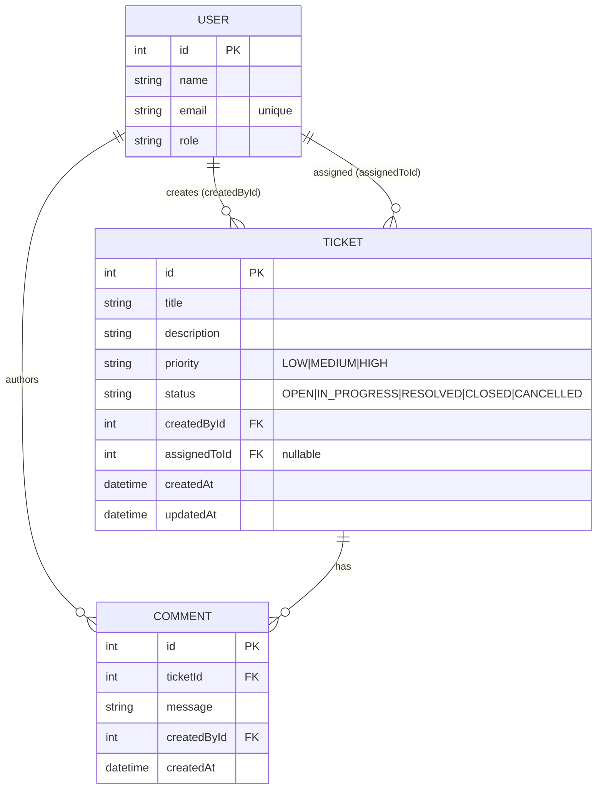
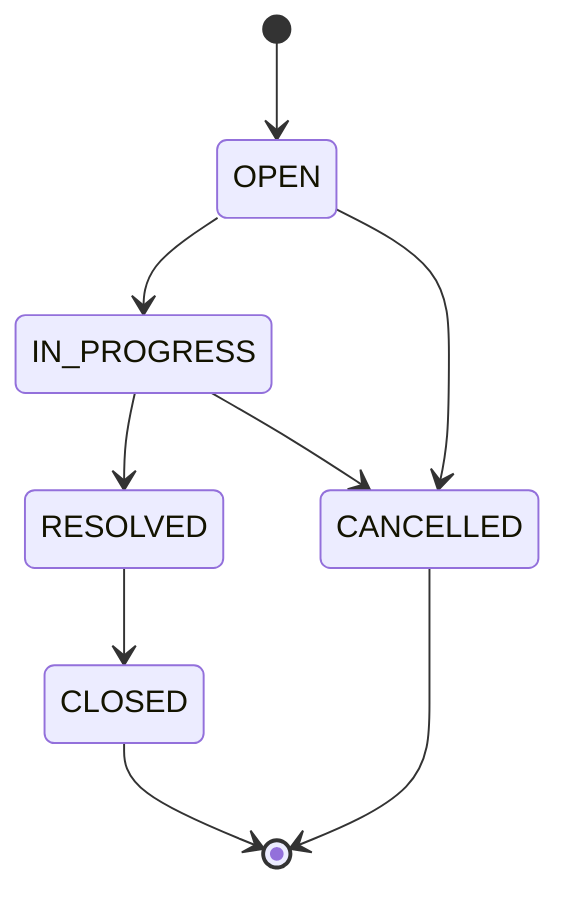

# Data Model

## Entity Relationship Diagram

## Entities

### User (seeded only)

| Field | Type   | Notes                    |
| ----- | ------ | ------------------------ |
| id    | Int PK | autoincrement            |
| name  | String |                          |
| email | String | unique                   |
| role  | String | e.g. AGENT, ADMIN        |

No user-management UI; users exist purely to be referenced as reporters,
assignees, and comment authors.

### Ticket

| Field        | Type      | Notes                                            |
| ------------ | --------- | ------------------------------------------------ |
| id           | Int PK    | autoincrement                                    |
| title        | String    | required, 1-200 chars                            |
| description  | String    | required, 1-5000 chars                           |
| priority     | String    | LOW / MEDIUM / HIGH, default MEDIUM              |
| status       | String    | state-machine value, default OPEN; **indexed**   |
| createdById  | Int FK    | -> User (RESTRICT on delete)                     |
| assignedToId | Int? FK   | -> User, nullable (SET NULL on delete)           |
| createdAt    | DateTime  | default now()                                    |
| updatedAt    | DateTime  | auto-updated                                     |

### Comment

| Field       | Type     | Notes                                   |
| ----------- | -------- | --------------------------------------- |
| id          | Int PK   | autoincrement                           |
| ticketId    | Int FK   | -> Ticket (CASCADE on delete); indexed  |
| message     | String   | required, 1-2000 chars                  |
| createdById | Int FK   | -> User (RESTRICT on delete)            |
| createdAt   | DateTime | default now()                           |

## Relationships & Delete Behavior

- A ticket has exactly one creator and at most one assignee.
- Deleting a user who created tickets is restricted; a deleted assignee's
  tickets have `assignedToId` set to null.
- Deleting a ticket cascades to its comments.

## Enumerations

- **Priority:** `LOW`, `MEDIUM`, `HIGH`.
- **Status:** `OPEN`, `IN_PROGRESS`, `RESOLVED`, `CLOSED`, `CANCELLED`.

Stored as strings because SQLite has no native enum type; validity is enforced
by Zod (`validation/schemas.ts`) and the state machine
(`domain/statusMachine.ts`).

## Status State Machine

Any transition not shown above is rejected by the backend with a `400`. `CLOSED`
and `CANCELLED` are terminal (no outgoing transitions).

## Indexes

- `User.email` unique.
- `Ticket.status` (supports status filtering).
- `Comment.ticketId` (supports loading a ticket's comments).

The authoritative schema is `src/backend/prisma/schema.prisma`; a plain-SQL
mirror is `database/schema.sql`.
