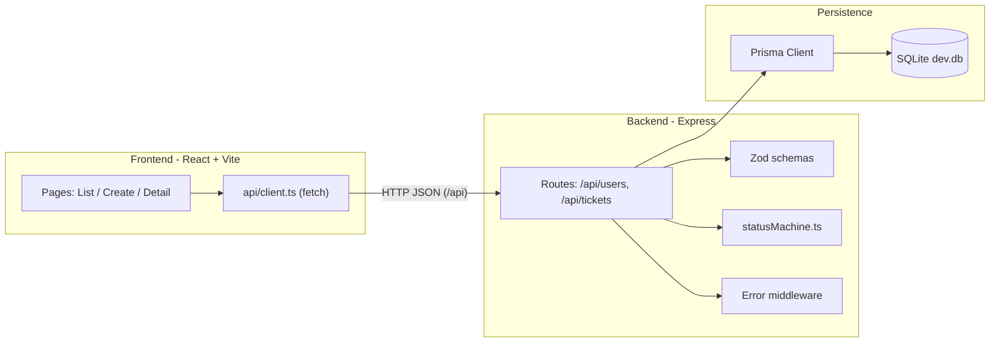

# Design Notes

## Architecture Overview



Three layers with clear responsibilities. The frontend never contains business
rules about which status transitions are legal; it only renders the
`allowedNextStatuses` the backend returns. This keeps the backend the single
authority.

## Frontend Design

- **Stack:** React 18 + Vite + TypeScript + Tailwind CSS, React Router for
  three routes (`/`, `/tickets/new`, `/tickets/:id`).
- **Data access:** a thin typed `api` client (`src/api/client.ts`) wraps `fetch`,
  centralizes the base URL and error parsing, and throws a typed `ApiError` that
  carries the server message so pages can display it.
- **State:** local component state with `useEffect`-driven loads; no global store
  is needed at this size. The list page debounces search input (250ms).
- **UX:** every async surface has explicit loading / empty / error states
  (`components/States.tsx`); status and priority render as color-coded badges;
  the detail page only shows buttons for transitions the backend permits.

## Backend Design

- **Stack:** Express + TypeScript (ESM). `createApp()` is separated from the
  server bootstrap so tests can mount the app without binding a port.
- **Routing:** `usersRouter` and `ticketsRouter`. An `asyncHandler` wrapper
  forwards rejected promises to the error middleware.
- **Domain:** `statusMachine.ts` owns the transition table and exposes
  `canTransition`, `allowedNextStatuses`, and validators. Routes consult it and
  throw `InvalidTransitionError` on a violation.
- **Data access:** a single shared Prisma client (`lib/prisma.ts`).

## Database Design

SQLite via Prisma. Three tables: `User` (seeded), `Ticket`, `Comment`. Tickets
reference a creator (`RESTRICT` on delete) and an optional assignee (`SET NULL`);
comments cascade-delete with their ticket. `status` is indexed to support the
status filter. `priority`/`status` are stored as strings (SQLite has no enum);
allowed values are enforced in the app layer. Full detail in `data-model.md` and
`database/setup-notes.md`.

## Validation Strategy

All request bodies and query params are parsed with Zod schemas
(`validation/schemas.ts`). Parsing failures throw `ZodError`, which the error
middleware turns into a `400` with a flattened field-error `details` object.
Beyond shape validation, routes verify that referenced `createdById` /
`assignedToId` users exist and return a clear `400` instead of a raw foreign-key
error. Status transitions are validated against the state machine, not just the
enum.

## Error Handling Strategy

A typed error hierarchy (`lib/errors.ts`: `AppError`, `NotFoundError`,
`ValidationError`, `InvalidTransitionError`) is mapped by a single Express error
handler to a consistent response:

```json
{ "error": { "message": "...", "details": { } } }
```

- Zod errors -> 400 "Validation failed" with field details.
- `AppError` subclasses -> their `statusCode` and message.
- Anything else -> 500 (logged server-side, generic message to the client).

A `notFoundHandler` covers unmatched routes.

## Testing Strategy Link

See [`test-strategy.md`](test-strategy.md) for scope and rationale, and
[`test-results.md`](test-results.md) for recorded runs.

## Key Trade-offs

- **SQLite over Postgres/Mongo:** zero-setup persistence that still exercises a
  real ORM and migrations — appropriate for a Core-scoped exercise.
- **`fetch` + ephemeral server over supertest in integration tests:** avoided a
  brittle ESM interop failure (see `debugging-notes.md`) with no loss of coverage.
- **Local component state over a data-fetching library:** fewer dependencies for
  a three-page app; a real project would likely adopt React Query.
- **Strings for enums:** required by SQLite; mitigated by centralized validation.
