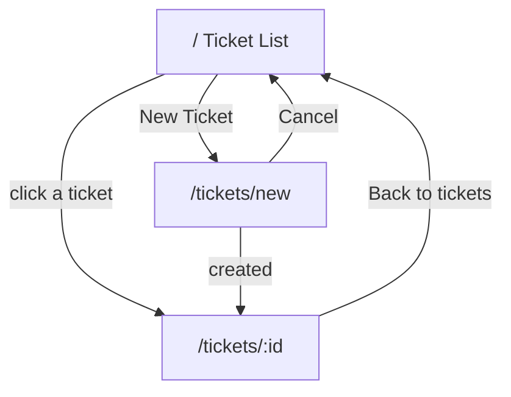

# UI Flow

## Screens

| Route            | Screen        | Purpose                                             |
| ---------------- | ------------- | --------------------------------------------------- |
| `/`              | Ticket List   | Browse, search, and filter tickets.                 |
| `/tickets/new`   | Create Ticket | Create a new ticket via a validated form.           |
| `/tickets/:id`   | Ticket Detail | View/edit a ticket, change status, manage comments. |

A persistent header shows the app title (links to the list) and a "New Ticket"
button.

## Navigation

## Ticket List (`/`)

- Search input (debounced ~250ms) matching title/description.
- Status filter chips: All, Open, In Progress, Resolved, Closed, Cancelled.
- Each row shows title, truncated description, status badge, priority badge,
  ticket id, and assignee.
- States: **loading** spinner text, **empty** ("No tickets match your filters."),
  **error** with a Try-again button.
- Search/filter changes re-query the backend (source of truth for filtering).

## Create Ticket (`/tickets/new`)

- Fields: Title, Description, Priority (select), Reporter (select), Assignee
  (optional select, defaults to Unassigned).
- Client-side required-field checks give immediate feedback; the backend remains
  the authority and its errors are shown inline.
- On success, navigates to the new ticket's detail page.

## Ticket Detail (`/tickets/:id`)

- **Main column:** title + description with an Edit toggle (inline edit of
  title, description, priority, assignee); a Comments section listing existing
  comments and a form to add one (with author select).
- **Sidebar:** a Details card (status, priority, assignee, reporter) and a
  Change Status card that renders one button per **allowed** next status
  (from `allowedNextStatuses`). Terminal tickets show "This ticket is in a
  terminal state."
- Any failed action (save, status change, comment) surfaces the backend message
  via an error panel; the list refreshes after a successful comment.

## Error & Empty State Handling

Shared components in `src/frontend/src/components/States.tsx`
(`LoadingState`, `ErrorState`, `EmptyState`) keep these states consistent across
pages. Because status transitions are driven by the backend-provided
`allowedNextStatuses`, the UI can never offer an illegal transition; if a race
still produced one, the backend rejects it and the message is displayed.
